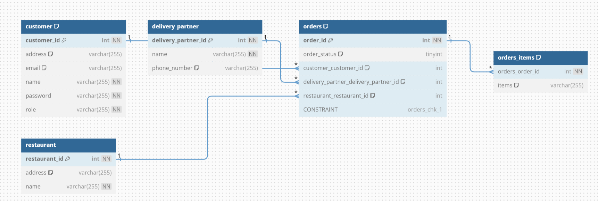
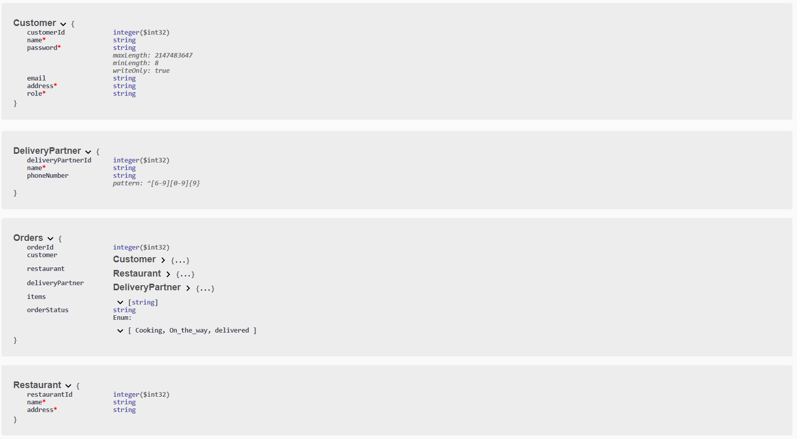

# Food Delivery System - Spring Boot Application
Welcome to the Food Delivery System Spring Boot Application! This application is designed to manage a food delivery system similar to Swiggy, encompassing Users, Restaurants, Customers, Orders, and Delivery Partners. It provides various operations for user management, authentication, order placement, delivery assignment, order status updates, and order history retrieval.

## Features

- **Entity Classes:**
  - **User:** Manage users with unique userId, username, password, role, and JWT.
  - **Restaurant:** Handle restaurants with unique restaurantId, name, and address.
  - **Customer:** Manage customers with unique customerId, name, email, and address.
  - **Order:** Handle orders with unique orderId, customer and restaurant details, delivery partner, items, and order status.
  - **DeliveryPartner:** Manage delivery partners with unique deliveryPartnerId, name, and phone number.

- **User Management:**
  - Add new Users, Restaurants, Customers, and Delivery Partners.
  - Authenticate and authorize users based on their roles (admin, user, delivery partner) using JWT.

- **Order Operations:**
  - Place an order from a Customer to a Restaurant.
  - Assign a Delivery Partner to an Order.
  - Update the order status (e.g., cooking, on the way, delivered).
  - Fetch a Customer's order history.

### ER-Diagram
 

### Database Schema

